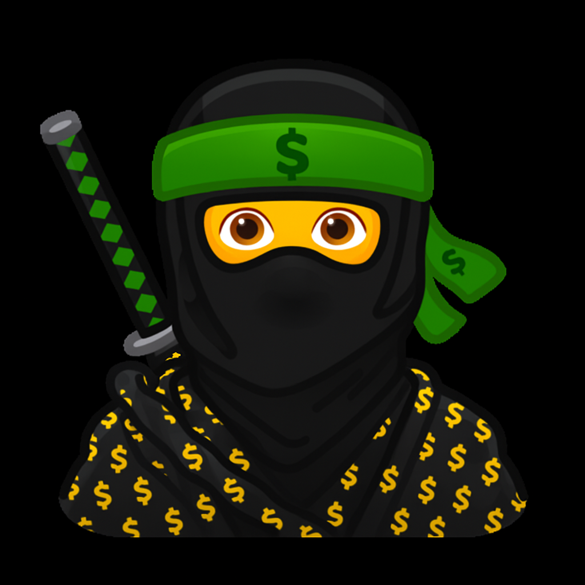

<div align="center">



# 💰 Lybianka

### *Your personal finance companion — track spending, set goals & visualise your money*

> 🚀 **Pet Project** — A fully offline, beautifully crafted Flutter finance tracker built from the ground up

<br/>


<br/>


</div>

---

## 📖 Overview

**Lybianka** is a fully offline personal finance tracker built with Flutter. No accounts, no cloud sync — your financial data stays on your device. Track income and expenses, customise categories with unique colours and icons, set financial goals, and visualise your weekly spending through beautiful charts.

The project demonstrates end-to-end Flutter development: BLoC-driven state management, a clean repository-pattern data layer, custom light/dark theming, rich flip-card animations, image handling, and a polished onboarding experience.

---

## ✨ Features

<details>
<summary><b>🎬 Onboarding</b></summary>

- Animated intro flow guided by a ninja mascot character
- Informational and disclaimer screens
- One-time display — skipped automatically on subsequent launches

</details>

<details>
<summary><b>🏠 Home Dashboard</b></summary>

- Personalised greeting with your chosen avatar
- **Flip-card balance display** — tap to reveal financial goal progress on the reverse
- **Weekly income bar chart** powered by `fl_chart`
- Quick-access shortcut to transaction history

</details>

<details>
<summary><b>➕ Add Transaction</b></summary>

- Toggle between **Income (+)** and **Expense (−)**
- Free-text amount input with a description field
- Choose from 20+ themed **category icons** (berries, travel, shopping, and more)
- Custom **colour picker** per category for visual clarity
- Date selector for backdating entries

</details>

<details>
<summary><b>📜 Transaction History</b></summary>

- Chronological list of all income and expense entries
- Per-record context menu options
- Real-time balance recalculation on every change

</details>

<details>
<summary><b>🎯 Set a Goal (Aim)</b></summary>

- Define a financial goal with a target amount
- Track progress as a circular percentage indicator on the home flip-card
- Attach a personal photo to your goal for motivation

</details>

<details>
<summary><b>💡 Advice</b></summary>

- Curated financial tips and money-saving advice

</details>

<details>
<summary><b>👤 Profile & Settings</b></summary>

- Choose from **28 avatar characters** — including 🦁 lion, 🦄 unicorn, 👾 alien, 🇺🇦 Ukraine flag, and more
- Upload a custom profile photo from camera or gallery with in-app **image cropping**
- Edit your display name
- Toggle **Light / Dark theme** — preference persisted across sessions

</details>

---

## 🏗️ Architecture

The app follows **Clean Architecture** principles with three clearly separated layers:

```
lib/
├── main.dart              # App entry point & BLoC dependency wiring
├── router/                # Named route map (MaterialApp routes)
├── theme/                 # Light & dark MaterialTheme definitions
│
├── blocs/                 # 🧩 State Management (BLoC / Cubit)
│   ├── category_bloc/     # Transaction category CRUD
│   ├── money_bloc/        # Balance calculation & retrieval
│   ├── settings_bloc/     # User profile persistence
│   │   └── theme_cubit/   # Light / dark theme toggle
│   ├── aim_category_bloc/ # Financial goal management
│   ├── intro_bloc/        # Onboarding page data
│   │   └── is_intro_seen_cubit/  # First-launch routing guard
│   └── income_cubit/      # Weekly bar chart data aggregation
│
├── repositories/          # 🗃️ Data Layer (interface + implementation)
│   ├── category_repository/
│   ├── settings_repository/
│   ├── aim_category/
│   ├── graphic_repository/
│   └── intro_repository/
│
└── features/              # 🎨 Presentation Layer
    ├── intro/             # Onboarding screens & widgets
    ├── home/              # Dashboard & weekly chart
    ├── add_money/         # Transaction entry form
    ├── history/           # Transaction list
    ├── settings/          # Profile & preferences
    ├── advise/            # Financial tips
    ├── set_aim/           # Goal setting
    └── widgets/           # Shared reusable components
```

### 🔄 Data Flow

```
👆 User Interaction
        ↓
🎨 Feature Screen   (Widget dispatches Event)
        ↓
🧩 BLoC / Cubit     (Business logic, emits State)
        ↓
🗃️  Repository      (Interface → Implementation)
        ↓
💾 SharedPreferences (JSON-serialised local storage)
```

### 🧩 BLoC Pattern

Every feature follows a consistent three-file structure:

| File | Role |
|---|---|
| `*_bloc.dart` | Business logic — handles events, emits states |
| `*_event.dart` | User interactions and external triggers |
| `*_state.dart` | Immutable UI state snapshot |

Cubits (`ThemeCubit`, `IncomeCubit`, `IsSeenCubit`) are used for simpler, single-responsibility state slices that don't require full event modelling.

---

## 🛠️ Tech Stack

### 🎯 Core

| Technology | Purpose |
|---|---|
| **Flutter 3.8+** | Cross-platform UI framework |
| **Dart 3.8+** | Programming language |

### 🧩 State Management

| Library | Purpose |
|---|---|
| `flutter_bloc` `^9.1.1` | BLoC & Cubit state management |
| `equatable` `^2.0.7` | Value equality for states and events |
| `talker_bloc_logger` `^4.9.2` | BLoC event/state logging for debugging |

### 💾 Local Storage

| Library | Purpose |
|---|---|
| `shared_preferences` `^2.5.3` | JSON-serialised persistent local storage |
| `path_provider` `^2.1.5` | Access to device file directories |
| `path` `^1.9.1` | Cross-platform path manipulation |

### 📊 Charts & UI

| Library | Purpose |
|---|---|
| `fl_chart` `^1.0.0` | Weekly income bar chart |
| `font_awesome_flutter` `^10.8.0` | Extended icon set |
| `flutter_colorpicker` `^1.1.0` | Category colour picker dialog |
| `flutter_flip_card` `^0.0.6` | Balance / goal flip-card animation |
| `percent_indicator` `^4.2.5` | Circular goal progress indicator |

### 📸 Media

| Library | Purpose |
|---|---|
| `image_picker` `^1.1.2` | Camera & gallery photo selection |
| `image_cropper` `^9.1.0` | In-app photo cropping |
| `video_player` `^2.10.0` | Video playback |
| `audioplayers` `^6.5.0` | Audio playback |

### 🔧 Utilities

| Library | Purpose |
|---|---|
| `uuid` `^4.5.1` | Unique ID generation for transaction records |
| `intl` `^0.20.2` | Date formatting and internationalisation |
| `url_launcher` `^6.3.1` | Open external URLs |

### ⚙️ Build Tooling

| Library | Purpose |
|---|---|
| `flutter_launcher_icons` `^0.14.4` | Generates platform app icons from a single PNG source |

---

## 🚀 Getting Started

### Prerequisites

- ✅ Flutter SDK `^3.8.1`
- ✅ Dart SDK `^3.8.1`
- ✅ Android Studio or VS Code with Flutter & Dart extensions
- ✅ Android emulator (API 21+) or a physical device

### ⚡ Quick Setup

```bash
# 1. Clone the repository
git clone https://github.com/VladSemeniuk/lybianka.git
cd lybianka

# 2. Install dependencies
flutter pub get

# 3. Run the app
flutter run
```

### 🔨 Clean Build

```bash
flutter clean && flutter pub get && flutter run
```

---

## 📦 Build

### 🤖 Android

```bash
# Debug APK
flutter build apk --debug

# Release APK
flutter build apk --release

# Release App Bundle (Google Play)
flutter build appbundle --release
```

### 🍎 iOS

```bash
flutter pub get
cd ios && pod install && cd ..
# Open ios/Runner.xcworkspace in Xcode → Product → Archive
```

---

## 🧪 Code Quality

```bash
# Static analysis
flutter analyze

# Run all tests
flutter test
```

---

## 🗂️ Asset Structure

```
assets/
├── app_icon/          # Launcher icon source image
├── appearences/       # 28 avatar characters (emoji-style PNGs)
├── berries/           # 22 transaction category icons
├── intro_icons/       # Onboarding ninja mascot sprites
└── screamer/          # Surprise video files 🙈
```

---

## 👨‍💻 Author

<div align="center">

**Vlad Semeniuk**
Flutter Developer

[](https://github.com/VladSemeniuk)

</div>

---

<div align="center">

Made with ❤️ using **Flutter** & **Dart**

</div>
